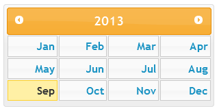

MonthPicker
===========

It's a modification of jquery ui datepicker to display a monthpicker. All configurable elements were kept. It's posible to use jquery ui theme.
So you can see documentation here [http://api.jqueryui.com/datepicker/](http://api.jqueryui.com/datepicker/).


Modification
============

Some feature is change from the databpicker.

changeMonth
-----------
Removed

firstDay
--------
Removed

numberOfMonths
--------------
Renamed in numberOfYears

selectOtherMonths
-----------------
Removed

showOtherMonthsType
-------------------
Removed

showWeek
--------
Removed

stepMonths
----------
Removed

weekHeader
----------
Removed

Examples
========

```html
<!doctype html>
<html lang="us">
<head>
	<meta charset="utf-8">
	<title>Month picker Example Page</title>
	<link href="css/ui-lightness/jquery-ui-1.10.3.custom.css" rel="stylesheet">
	<link rel="stylesheet" href="http://code.jquery.com/ui/1.10.3/themes/smoothness/jquery-ui.css">
	<script src="http://code.jquery.com/jquery-1.9.1.js"></script>
	<script src="http://code.jquery.com/ui/1.10.3/jquery-ui.js"></script>
	<script src="jquery-tcm-monthpicker.js"></script>
	<script>
	$(function() {
		$( "#datepickermonthi" ).monthpicker();
	});
	</script>
<body>
<div id="datepickermonth"><div/>
</body>
</html>
```
